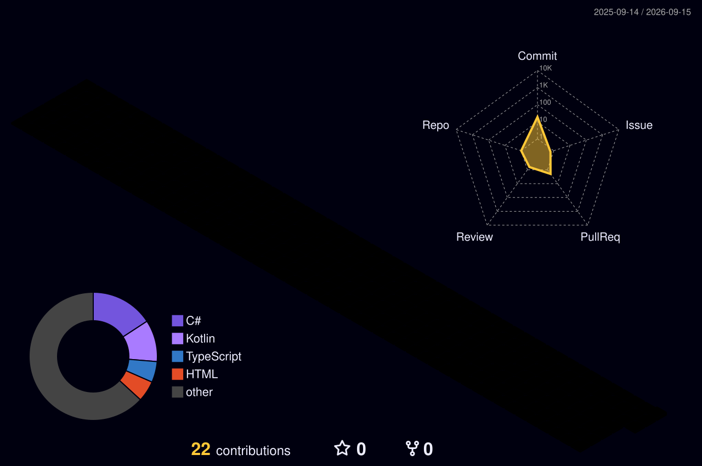

<div align="center">


<br/>

[](https://github.com/MustafaTaweel1)
[](https://github.com/MustafaTaweel1)
[](https://github.com/MustafaTaweel1)

</div>

---

## 🧬 About Me

```yaml
# mustafa.yaml
name: Mustafa Taweel
role: DevOps Engineer & IT Student
university: Al-Quds University 🎓
location: Palestine 🇵🇸
internship: Palestine Islamic Bank — DevOps & Web Services

focus:
  - Infrastructure as Code (Terraform, Helm)
  - Container Orchestration (Docker, Kubernetes)
  - CI/CD Pipelines (GitHub Actions, GitLab CI)
  - Cloud Platforms (AWS · GCP · Azure)
  - Observability & Monitoring

currently_learning:
  - Redis (caching, pub/sub, streams)
  - Next.js + TypeScript (modern frontends)
  - Advanced Kubernetes (RBAC, Helm, operators)

motto: "Automate everything. Monitor everything. Break nothing. 🚀"
```

---

## 🧰 Tech Arsenal

### ☁️ Cloud & DevOps  ← *Primary Focus*

<p align="center">


</p>

### 🎨 Frontend

<p align="center">


</p>

### ⚙️ Backend

<p align="center">


</p>

### 💻 Languages

<p align="center">


</p>

### 🗄️ Databases

<p align="center">


</p>

### 🛠 Tools & OS

<p align="center">


</p>

---

## 📊 GitHub Stats

<div align="center">


&nbsp;


<br/><br/>


</div>

---

## 📈 Contribution Graph

<div align="center">


</div>

---
# 🌐 3D Contribution Globe

> ⚙️ *Generated daily by CI — [run the workflow manually](../../actions/workflows/profile-3d.yml) on first use.*



---

# 🐍 Contribution Snake

> ⚙️ *Generated daily by CI — [run the workflow manually](../../actions/workflows/snake.yml) on first use.*


---

# 📬 Connect with Me

<p align="center">
  <a href="https://github.com/MustafaTaweel1">
    
  </a>
  &nbsp;
  <a href="https://www.linkedin.com/in/YOUR-LINKEDIN-HANDLE">
    
  </a>
</p>

---

<p align="center">
  💬 Open to collaborations, DevOps discussions, and open-source contributions!
</p>

<p align="center">
  
</p>


<!-- ## 🌐 3D Contribution Globe

> ⚙️ *Generated daily by CI — [run the workflow manually](../../actions/workflows/profile-3d.yml) on first use.*

<div align="center">


</div>

---

## 🐍 Contribution Snake

> ⚙️ *Generated daily by CI — [run the workflow manually](../../actions/workflows/snake.yml) on first use.*

<div align="center">

<picture>
  <source media="(prefers-color-scheme: dark)" srcset="https://raw.githubusercontent.com/MustafaTaweel1/MustafaTaweel1/output/github-snake-dark.svg"/>
  <source media="(prefers-color-scheme: light)" srcset="https://raw.githubusercontent.com/MustafaTaweel1/MustafaTaweel1/output/github-snake.svg"/>
  
</picture>

</div>

---

## 📫 Connect with Me

<div align="center">

[](https://github.com/MustafaTaweel1)
[](https://www.linkedin.com/in/mustafa-altaweel-30222025b)

</div>

---

<div align="center">

💬 **Open to collaborations, DevOps discussions, and open-source contributions!**

</div>

<div align="center">

</div> -->